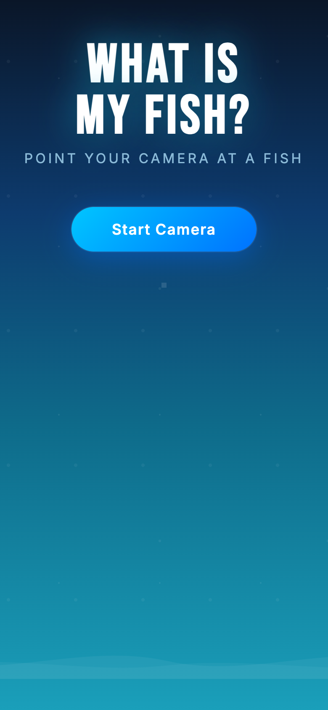

# What Is My Fish?



A browser-based fish identifier using a Teachable Machine image model and TensorFlow.js.

## How it works

Point your camera at a fish and the model predicts which species it is in real time.

## Built with

- **[Kaggle](https://www.kaggle.com)** — used to find and prepare the fish image dataset for training
- **[Teachable Machine](https://teachablemachine.withgoogle.com)** — used to train the image classification model, no code required
- **[TensorFlow.js](https://www.tensorflow.org/js)** — runs the trained model directly in the browser

Model hosted at: `https://teachablemachine.withgoogle.com/models/fBz1q_mLZf/`

## How to run

```bash
npx serve .
```

Then open `http://localhost:3000` in your browser.

## How to test on iPhone (requires HTTPS)

1. Start the local server: `npx serve .`
2. In a second terminal, start an HTTPS tunnel: `ssh -o StrictHostKeyChecking=no -R 80:localhost:3000 localhost.run`
3. Copy the `https://xxxx.lhr.life` URL from the tunnel output
4. Open it in Safari on your iPhone

> iOS Safari blocks camera access on plain `http://` URLs — the tunnel provides the required HTTPS.

## Features built

- Ocean-themed background with animated bubbles and wave
- Big impact title using Bebas Neue font
- **Best match card** — shows the top predicted fish prominently
- **Probability bars** — all candidates ranked by confidence, updated live
- **Camera flip button** — overlaid on the webcam view, appears after starting; toggles between back and front camera
# WhatIsThisFish-
